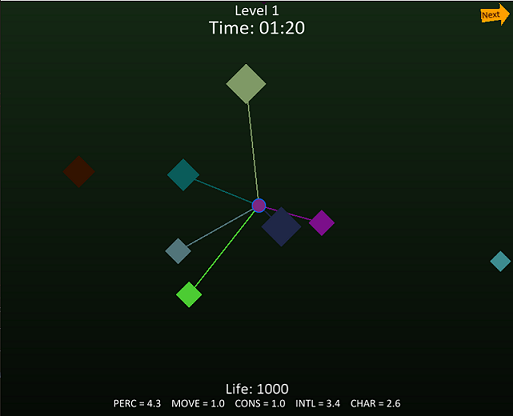
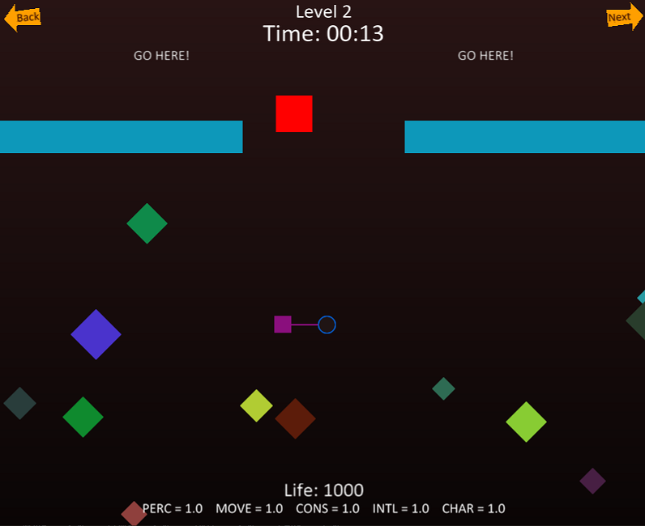
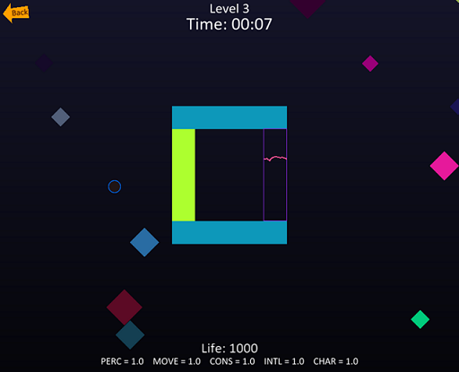

# biomorph
A little game to test ideas about metamorphosis and RPG

## Installation

1. Install Arcade:
```
pip3 install arcade==2.1.3
```

2. Clone this repo then launch the game, that's it!
```
python game.py
```

3. (Optional) To run aptitude_unittest.py please install additional packages:
```
pip install numpy
pip install matplotlib
```

## How to play?
You (the little circle at the center of the scene) are a **biomorph**: you can use the mouse and click somewhere or on something to move.
You are surrounded by colorful shapes representing other creatures.
Once you click on a shape, you can morph by soaking up its characteristics (like color and size). 
You need to be on the shape to activate a morph.
You have life points (Life) and when they're going down to zero, you die and the ame is over. 
Each creature including you has **aptitudes** like in RPG games. 
Morphs change aptitudes and by doing so, you can pass challenges that require a certain level for some aptitudes.
**Watch out, some of them are physical and others are psychical, and they evolve differently!** (and that means there are different ways to solve the challenges)

The game includes 3 levels demonstrating different use cases:

### Level 1 (training)
This level has no objective except to let you freely try morphs and see how aptitudes evolve. Enjoy!


### Level 2 (the guard)
This level has a guard (the big red square) that protects the upper side of the screen. Your mission is to pass the guard and get to that zone in a minimum of time. 
Good luck!


### Level 3 (the safe)
This level has a safe in the middle of the screen and your mission is to get into the safe zone and then exit without dying. 
Good luck again!

